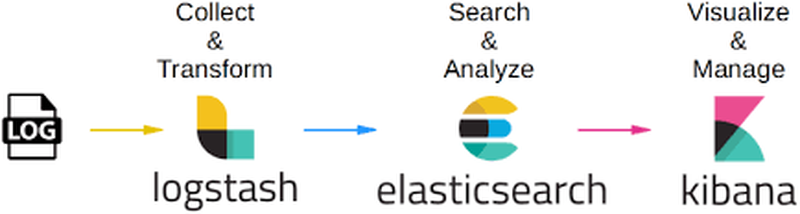
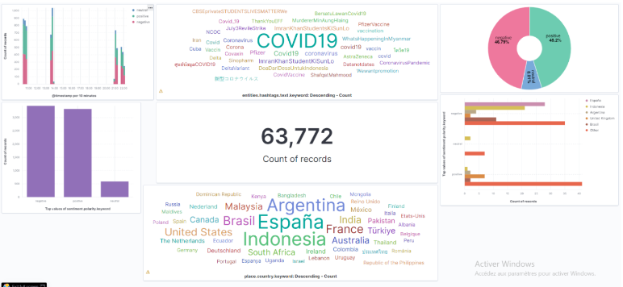

# Monitoring and analysis of tweets in real time -

As a part of the projects within INPT , This project aims to implement an ETL pipeline from colleting data to ingestion to  processing data and finally visualizing in it in a dashboard.
<b>To implement this project we choosed ELK stack</b>  

<h2>The goal of the project </h2>

 The purpose of this project is to perform an analysis of tweets regarding vaccins of coronavirus and make a sentiment analysis to understand different opinions about  it, weither people are alike to make it or they are suspicious about it or they are neutral  

<h2>hat is ELK STACK </h2>

"ELK" is an acronym for three open source projects: Elasticsearch, Logstash, and Kibana. Elasticsearch is a search and analytics engine. Logstash is a server-side pipeline, intended for data processing (ETL type). His mission ? Simultaneously ingest data from multiple sources, then transform it and send it to a storage system like Elasticsearch. Kibana allows users to visualize data with tables and graphs in Elasticsearch.

   

  
  

  
<h2>Awesome DASHBOARD with KIBANA </h2>

   
   

  
  

